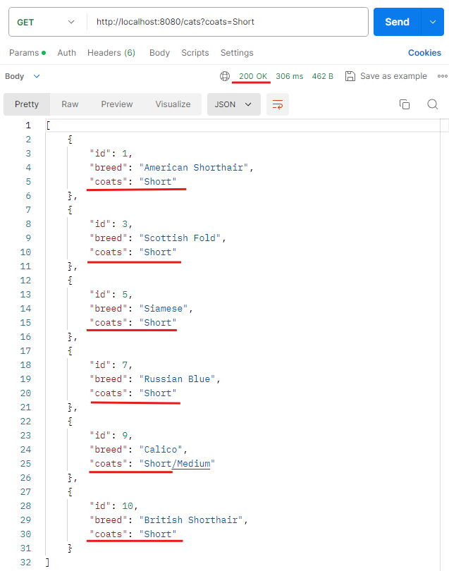
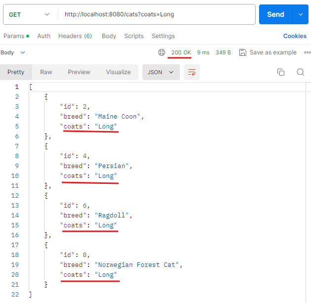
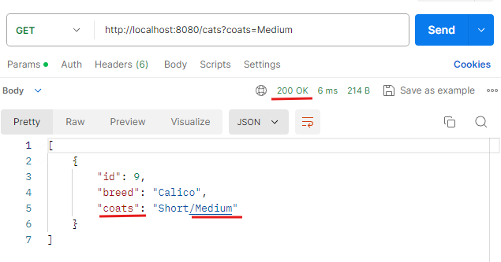
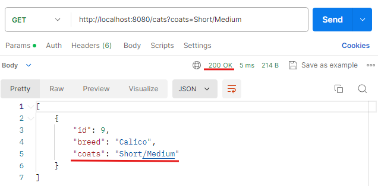
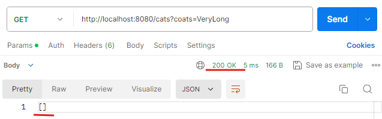
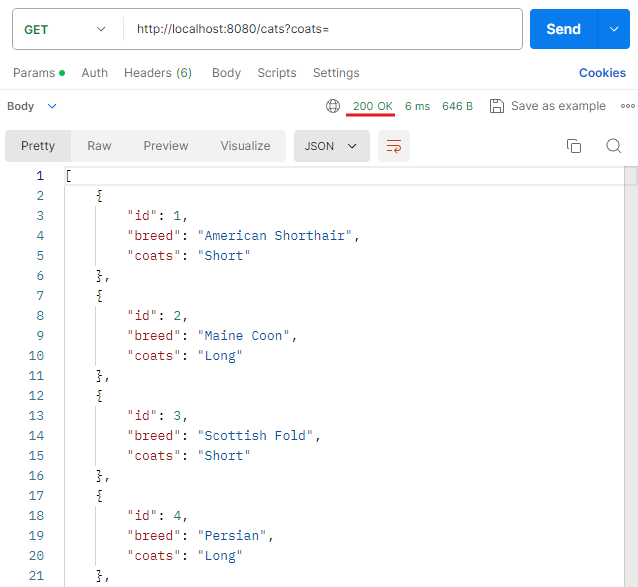
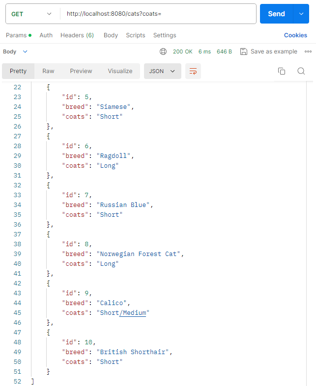

# 概要

第9回課題内容は以下の通り。

- Controller、Service、Mapperを利用してRead処理を実装。
- 例外をハンドリングする処理を実装。
    - これまでに作ったコードに変更を加える形でOK。

なので今回は、[第8回課題](https://github.com/Ema-Sakai/Assignment-8)に変更を加える形で進める。  
ディレクトリ構成は第8回課題参照。
 

## 初期動作確認

セットアップ時のレスポンス動作確認は、Postmanを使用。
下記の要件を満たしたことを確認済み。

- こちらがリクエストしたクエリ文字列を含むデータを、json形式で返す。
- こちらがリクエストしたクエリ文字列を含むデータがない場合は、空の配列`[]`を返す。
- クエリ文字列を指定しない場合は、全データを返す。
   

### 動作確認結果画像

1. `http://localhost:8080/cats?coats=Short` でリクエストした場合。
   

2. `http://localhost:8080/cats?coats=Long` でリクエストした場合。
   
3. `http://localhost:8080/cats?coats=Medium` でリクエストした場合。
   
4. `http://localhost:8080/cats?coats=Short/Medium` でリクエストした場合。
   
5. `http://localhost:8080/cats?coats=VeryLong` でリクエストした場合。
   
6. `http://localhost:8080/cats?coats=` でリクエストした場合。
   
   
